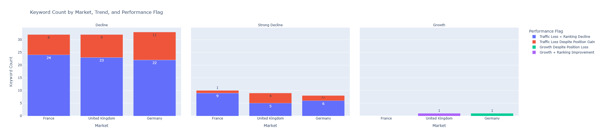
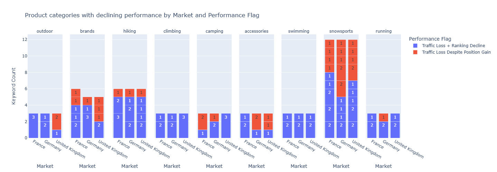

# Period-over-period-comparison | Using Google Search Console data to identify optimisation priorities.

## Project goal:

The goal is to take an input of performance data over time, configure 2 time periods for comparison and be able to see which pages / page/keyword combinations have declined, what has been their contribution to the decline and a conclusion for what has driven the decline.

## Business Problem:

In simple terms, this workflow aims to take Google Search Console data across 2 configurable time periods and run a series of calculations that identify the following:
1) Which markets, pages have experienced a significant change in performance between 1 period and another?
2) What is the controbution of the market/page to the total change happening?
3) What is the impact of the page relative to the others?

With the output file, SEO professionals can utilise the file for priortisation of efforts to recover performance where it has been lost or report on areas of growth where that has been the case.

## Skills demonstrated:
SQL - 
 - CTE - performing various pre calculations and aggregations with the original source file
 - SELECT, WHERE - specify the data selected and base level of filtering
 - CASE WHEN - conditional handling of data to place labels (Period 1 or Period 2) or perform calculations (calculating difference in metrics between periods)
 - NULLIF - handling null values when dividing i.e in case there are zero clicks but more than zero impressions.
 - GROUP BY - data aggregation
 - CONCAT - concatenating data for the purpose of labelling

## Example conclusions & visualisations

###Conclusions & Observations

1 - In all 3 markets, each is exhibiting a decline in performance across the comparative time periods.
2 - For the majority of declines, this is explained as traffic loss brought on by a ranking decline.
3 - Interestingly, a portion of circa 25% of the declining performance can be accounted for by a traffic loss but with no decline in position. This warrants further investigation to understand the reasons for the decline if the data shows no ranking change.

